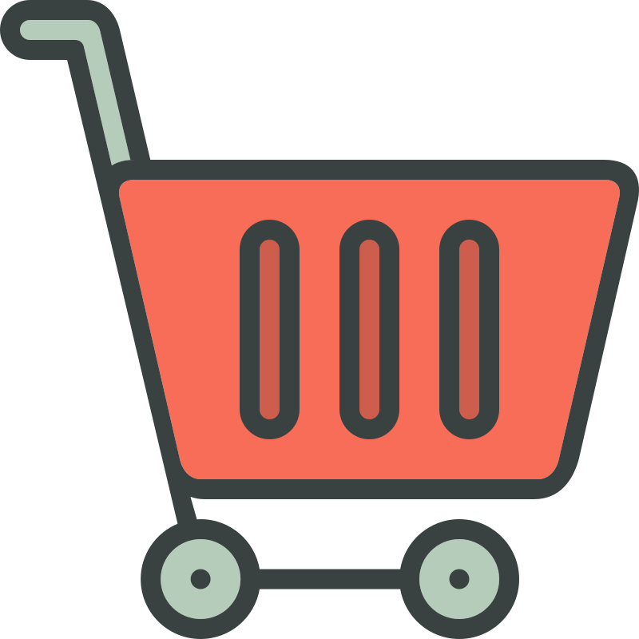

# React Shopping Cart

    

A react based shopping cart using react's hooks useContext and useReducer.

I used dummyjson.com API to get a mock json file for the products of the store, and implemented a reducer in a context to make the shopping cart work.